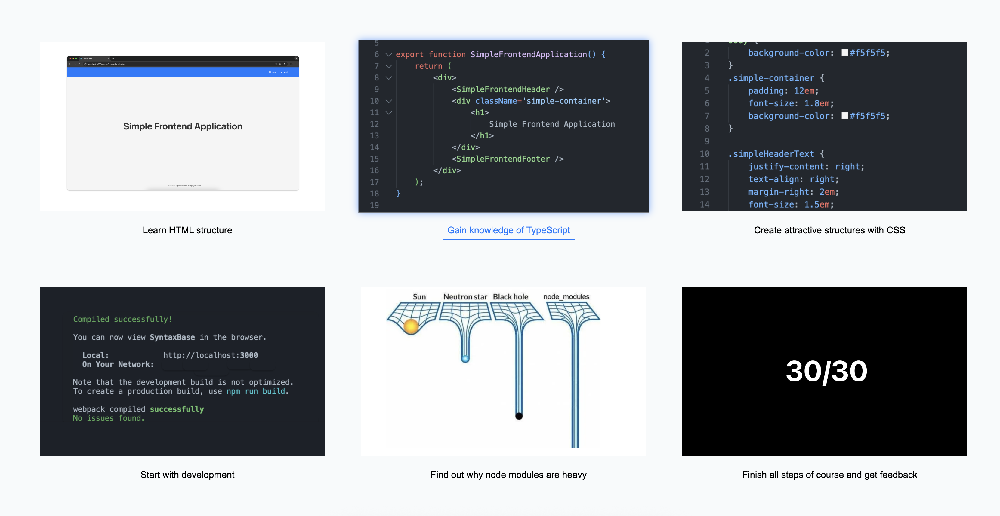

# SyntaxBase

**SyntaxBase** is a full-stack web application designed to help users **learn programming** and **build real-world applications** from the ground up. Built with **React**, **Spring Boot**, and **PostgreSQL**, the platform provides a structured, self-paced learning experience across multiple domains of software development.

SyntaxBase offers a wide range of tutorials, exercises, and interactive content organized into **five core sections**:

- **Web Development**
- **Game Development**
- **Database Management**
- **Problem Solving**
- **Instructions & Lectures**

Each section is divided into **three tiers**—**Beginner**, **Intermediate**, and **Advanced**—allowing users to progress based on their skill level and experience.

## Community

SyntaxBase includes an integrated **community forum** where users can:
- Share ideas and projects
  - threaded forum with sections
  - ability to modify own message
- Give and receive feedback
  - feedback from instructors or other developers
- Connect with other developers and tech enthusiasts
---
## Table of Contents
- [Features](#features)
- [Tech Stack](#tech-stack)
- [Architecture](#architecture)
- [Getting Started](#getting-started)
- [Project Structure](#project-structure)
- [Demonstration](#demonstration)

---
## Features
Some core features in SyntaxBase include:
### User
- User registration & authentication
- Exploring tutorials and courses
- Getting help & consultation via email
- Personal homepage with options to view courses/tutorials
- Rate course/tutorial
- Check progress per course/tutorial
- Authenticated users can enroll courses
- Courses provide more features than tutorials
  - more examples
  - more lessons
  - friendly feedback after every lesson
  - in-lesson code demonstration and ability to customize code in browser
  - final project after finishing lessons with step-by-step guide
  - quiz after project to confirm knowledge
- Authenticated users have access to community forum
- Authenticated users can post, reply and delete posts in forum
- Authenticated users are notified when somebody replies to their post
- Authenticated users can change personal information
- Authenticated users can apply for instructor role
- After their request is approved they will receive email with confirmation
- Ability to enroll course via shared link from instructor
- Authenticated users can mark notifications as read
- Authenticated users can report messages
- Users can receive email containing unread notifications
- Authenticated users can view earned certificates
- Authenticated users can view earned awards
- Authenticated users can chat with each other in real time via integrated chat

### Admin

The admin dashboard provides full control over user lifecycle, course analytics, and forum moderation tools.

#### User Management
- Approve instructor role requests
- Activate / deactivate user accounts
- Delete user accounts
- View user details and status
- Remove user from enrolled courses
- Soft-delete and restore user messages

#### Course Management
- Monitor top-rated courses by average rating
- Track course completion rates

#### Forum Moderation
- Delete inappropriate or flagged messages
- Restrict users from participating in discussions


### Instructor
Instructors are verified users granted elevated privileges to create and manage their own courses.

#### Course Managment
- Create and publish new courses
- Delete owned courses
- Edit and update existing courses
- Upgrade course tier from FREE to ULTIMATE

#### Engagement
- Share enrollment links via email
- Hold elevated Instructor role in forum discussions

### Forum / Community Module

This module enables structured, role-based community interaction through a lightweight forum system.

#### Core Features

- **Section-Based Posting**  
  Users can create posts in up to five predefined sections, promoting organized discussions and content categorization.

- **Post Structure**  
  Each post includes:
    - Message body
    - User name and role
    - Timestamp of creation

- **Author Permissions**  
  Post creators can **edit** or **delete** their own posts at any time.

- **Replies & Moderation**
    - All posts support **threaded replies**
    - Reply authors can **modify**, **delete**, or **report** replies
    - Reporting enables community-driven moderation workflows

- **Sorting Options**  
  Posts can be sorted by:
    - **Date** – for chronological relevance
    - **Thread/Section** – to maintain contextual clarity

---
# Tech stack


<h3>Frontend</h3>
<ul class="horizontal-list">
    <li>
        <a href="https://www.w3schools.com/css/" target="_blank" rel="noreferrer">
            
        </a>
        CSS
    </li>
    <li>
        <a href="https://www.w3.org/html/" target="_blank" rel="noreferrer">
            
        </a>
        HTML5
    </li>
    <li>
        <a href="https://reactjs.org/" target="_blank" rel="noreferrer">
            
        </a>
        React
    </li>
  <li>
   Typescript
  </li>
</ul>

<h3>Backend</h3>
<ul class="horizontal-list">
    <li>
        <a href="https://www.java.com" target="_blank" rel="noreferrer">
            
        </a>
        Java
    </li>
    <li>
        <a href="https://spring.io/" target="_blank" rel="noreferrer">
            
        </a>
         Spring
    </li>
  <li>
     Tomcat
  </li> 
</ul>
<h3>Database</h3>
  <li>
        <a href="https://www.postgresql.org" target="_blank" rel="noreferrer">
            
        </a>
         PostgreSQL
    </li>
<h3>Tools</h3>
<li>
   Visual Studio Code
  
</li>
<li>
     
   Intelij
  </li>
<li>
    
   Git
  </li>

---
## Getting started

## Prerequisites

Before you begin, ensure you have the following installed on your machine:

### Frontend
- [Node.js](https://nodejs.org/) (v18+ recommended)
- [npm](https://www.npmjs.com/) or [Yarn](https://yarnpkg.com/) (npm comes with Node.js)
- A modern web browser (e.g., Chrome, Firefox)

### Backend
- [Java JDK 17+](https://www.java.com/en/)
- [Maven](https://maven.apache.org/) (or Gradle, if your project uses it)
- [Spring Boot](https://spring.io/projects/spring-boot) (handled via Maven/Gradle)

### Database
- [PostgreSQL](https://www.postgresql.org/) (v14+ recommended)
  - Ensure a local or remote instance is running
  - Create a database and user with the proper privileges

### Optional (Recommended for Development)
- [Docker](https://www.docker.com/) (to run PostgreSQL easily)
- [Postman](https://www.postman.com/) for testing APIs
- [pgAdmin](https://www.pgadmin.org/) or another PostgreSQL client for database management

### Environment Setup
Since this is side project .env files must be manually configrued.
Make sure to configure the following:

- `.env` file for frontend (e.g., API base URL)
- `application.properties` or `application.yml` for Spring Boot (DB URL, credentials, etc.)

### Development environment

For development environment VSCode and/or IntelijIDEA is recommended.

- Clone or download project
- Open project inside desired development environment
---
## Development Environment

The recommended integrated development environment (IDE) for this project is **IntelliJ IDEA**.

### Project Setup

1. **Clone or download** the repository from your version control system.
2. Open IntelliJ IDEA and navigate to:  
   `File → New → Project from Version Control...`
3. Paste the repository URL and select  
   **"Load Maven build script"** to import the project properly.

#### Screenshots
**Cloning the repository**


**Importing the project using Maven**


---
## Frontend setup

To launch the frontend application, follow these steps:

1. Open a terminal window inside **IntelliJ IDEA**/**VSCode** (or use your system terminal).
2. Navigate to the frontend directory:  
   `/SyntaxBase/frontend/src`
3. Install the dependencies:
   ```bash
   npm install
---
4. Start frontend
   ```bash
   npm start
---

#### Screenshots
**Installing dependencies**


**Starting frontend**


---
## Backend setup

To start the backend application, follow these steps:

1. Ensure that **Java 17** (or higher) is installed.
2. In IntelliJ, navigate to:  
   `SyntaxBase/backend/src/main/java/opp`
3. Locate the `BackendApplication.java` class.
4. Right-click the file and select **Run** to start the Spring Boot server.

#### Screenshot

*Running the Spring Boot application*


---
## Project structure

### Project Structure (High Level) - v2.2.0

```text
SyntaxBase/
├── .github/
├── backend/
├── database/
├── docs/
├── frontend/
├── microservice-chat/
├── microservice-notifications/
├── microservice-shared/
├── CHANGELOG.MD
├── LICENSE
├── README.MD
```

### Frontend

```text
src/
├── components/
├── functions/
├── hooks/
├── images/
├── models/
├── pages/
│   ├── databaseCourses/     
│   ├── gameCourses/         
│   ├── problemSolvingCourses/
│   └── webCourses/       
├── services/   
└── styles/
└── utils/
```

### Backend

```text
com/programming.tutorial/
├── config/
├── controller/
├── dao/
├── domain/
├── dto/
├── services/
└── BackendApplication.java
```

### Microservice-chat

```text
microservice_chat/
├── config/
├── controller/
├── dao/
├── domain/
├── dto/
├── services/
└── MicroserviceChatApplication.java
```
---

### Microservice-notifications

```text
com/SyntaxBase/
├── config/
├── controller/
├── dao/
├── domain/
├── dto/
├── listener/
├── services/
├── utils/
└── MicroserviceNotificationsApplication.java
```
---

### Microservice-shared

```text
shared/
├── dto/
```
---

## Demonstration

Here are some example screenshots from the app.  
For a full visual walkthrough, visit [Full UI Showcase](docs/FEATURES_OVERVIEW.md).

### Homepage


### Tutorial example (initial lesson)


### User homepage


### Forum


### Apply to course example




---