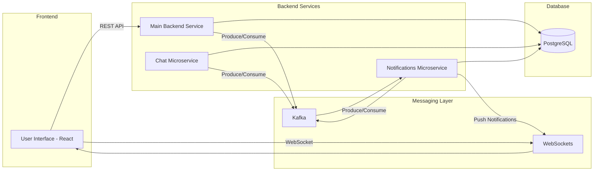
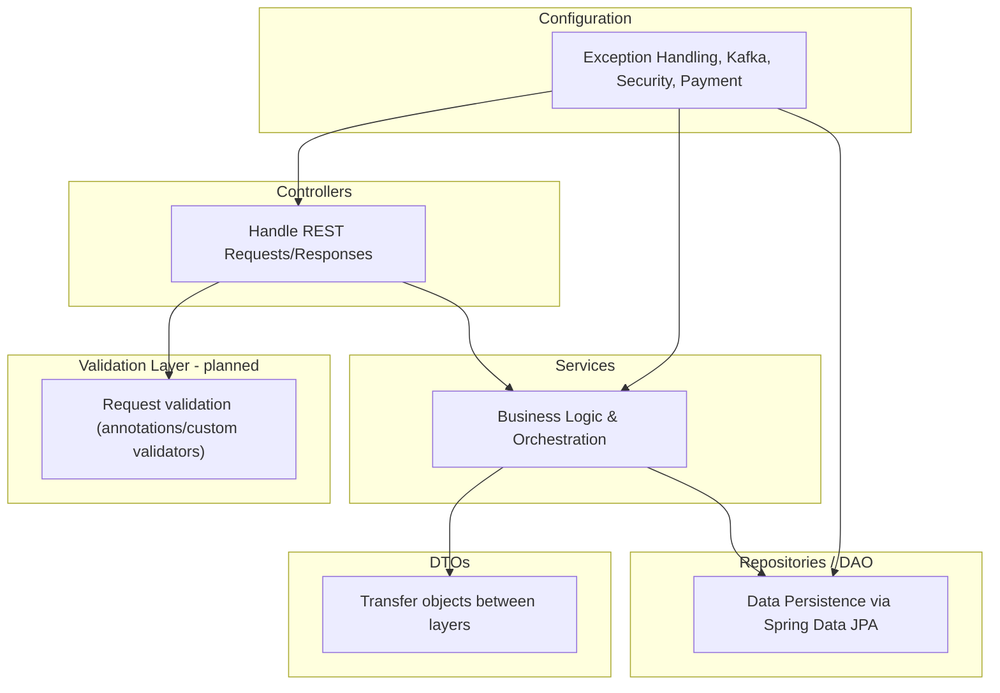
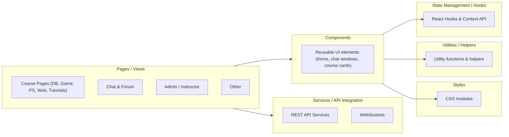
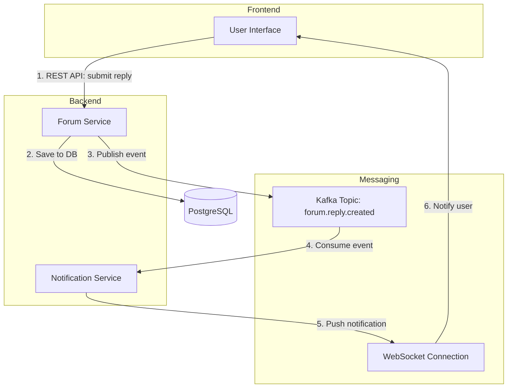

# Architecture – SyntaxBase

This document describes the architecture of **SyntaxBase**, including its high-level system design, service responsibilities, backend/frontend structure and communication flows.

## High-Level System Design

The platform follows a **microservices-based architecture**, deployed in a containerized environment with **Docker**.  
Services communicate primarily through **REST APIs**, with asynchronous flows handled by **Kafka** and real-time updates powered by **WebSockets**.

## Microservices Breakdown

- **Main Backend Service**
    - Spring Boot project
    - Core business logic: user management, courses, forum content and many more
    - Interacts with Chat and Notification microservices via Kafka
    - Reads/writes to PostgreSQL tables: users, posts, courses, forum and many more

- **Notification Microservice**
    - Spring Boot project
    - Responsible for real-time notifications
    - Users notified for:
        - reply on forum post
        - unread chat messages
    - Subscribes to Kafka topics for events
    - Pushes updates via WebSockets

- **Chat Microservice**
    - Spring Boot project
    - Real-time chat messaging between users
    - Subscribes to Kafka topics
    - Notifies Notification microservice about unread messages

- **Shared Microservice**
    - Spring Boot project
    - Contains shared DTOs for chat messages, notifications, etc.
    - Ensures consistency and reduces tight coupling

## Backend Structure

The backend is built with **Spring Boot** and follows a **layered architecture**:

- **Configuration** – centralizes application setup: exception handling, Kafka producer configs, security, payment options, logging etc.
- **Controllers** – expose REST endpoints; validate requests; call Services
- **Services** – core business logic; orchestrate Repositories, other microservices and external systems
- **Repositories (DAO)** – isolate database access using Spring Data JPA for loose coupling
- **DTOs (Data Transfer Objects)** – clean transfer of data between layers and services
- **Validation Layer** – ensures incoming requests meet criteria using annotations and custom validators

The backend of **SyntaxBase** follows a **layered architecture**, where each layer has a distinct responsibility. This structure ensures clean separation of concerns, easier maintenance and consistent flow of data. Above mentioned configuration is displayed in the diagram below.

*Note: A dedicated validation layer is planned for future iterations to centralize and enforce data validation systematically.*

## Frontend Structure

The frontend of **SyntaxBase** is built with **React** and designed for modularity, reusability and maintainability.  
It interacts with backend services via **REST APIs** and receives real-time updates through **WebSockets**.

Description of Frontend Layers: 

- **Components**: Reusable UI elements like forms, chat windows, course pages, buttons etc.

- **Functions** – legacy helper functions kept for backward compatibility (planned for refactor/removal)

- **Hooks** – custom React hooks for session management and token lifecycle, including automatic checking of token expiration and refreshing via backend calls.

- **Images** – static assets used in the frontend, such as icons, illustrations and images displayed in course content, notifications and UI components. Used to maintain visual consistency and separates assets from logic.

- **Models / Types** – TypeScript interfaces, types and helper constants that define the shape of data objects (e.g., Notification, User, Tier) and standardize usage across components and services.

- **Pages**: Organized by course type (Database, Game, Problem Solving, Web etc.), user role, plus authentication and forum to display content.

- **Services**: Handles communication with the micorservices using REST APIs and real-time updates with WebSockets.

- **Styles**: CSS or SCSS modules for styling components and pages consistently.

- **Utilities / Helpers**: Contains shared helper functions and utility modules used across components and pages.

## Communication Flows

SyntaxBase combines multiple communication patterns to balance **reliability**, **responsiveness** and **decoupling**.  
The platform uses **REST APIs** for synchronous calls, **Kafka topics** for asynchronous microservice events and **WebSockets** for real-time updates.

### Patterns Overview

- **REST APIs** – synchronous request/response pattern between **frontend pages/components** and **backend services**. Used for CRUD operations like user registration, login, course content retrieval and updates.
- **Kafka Topics** – asynchronous, event-driven communication between **microservices**, allowing decoupling. Example: when a new forum post reply is created, a message is published to Kafka, which the Notification microservice consumes.
- **WebSockets** – push-based, real-time updates from backend to frontend. Used for live chat, notifications or dynamic content updates without polling.

### Example Scenario

1. User posts a reply to post on a forum.  
2. Frontend calls backend via **REST API** to save the post.  
3. Backend publishes an event to **Kafka topic** `forum.reply.created`.  
4. Notification microservice consumes the event and pushes a notification to all relevant users via **WebSocket**.

## Summary

The **SyntaxBase architecture** demonstrates full-stack approach combining **microservices**, **layered backend design** and **modular frontend structure**. Key points include:

- **Scalable Microservices** – separate services for core backend, chat, notifications and shared DTOs ensure loose coupling and maintainability.  
- **Layered Backend** – configuration, controllers, services, repositories and DTOs provide a clear separation of concerns and facilitate testing and evolution of business logic.  
- **Modular Frontend** – React components, pages, hooks, services, utilities and styles enable reusable and maintainable code, with REST APIs and WebSockets for real-time interaction.  
- **Hybrid Communication Patterns** – REST for synchronous CRUD operations, Kafka for asynchronous event-driven messaging and WebSockets for push notifications and chat, balancing responsiveness, reliability and decoupling.  
- **End-to-End Flow** – example scenarios (forum replies, notifications) illustrate how data moves through the system from frontend action to backend persistence, microservice events and user notification.  

This architecture is designed to **showcase good engineering practices**, support **future scalability** and provide a clear, maintainable structure suitable for learning, collaboration and potential extension to production-grade systems.