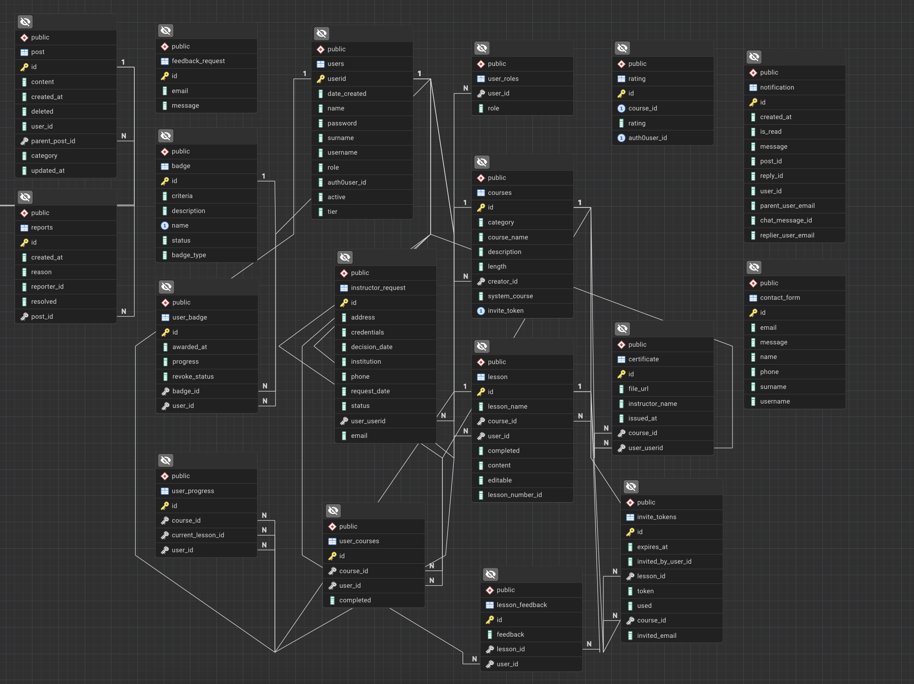
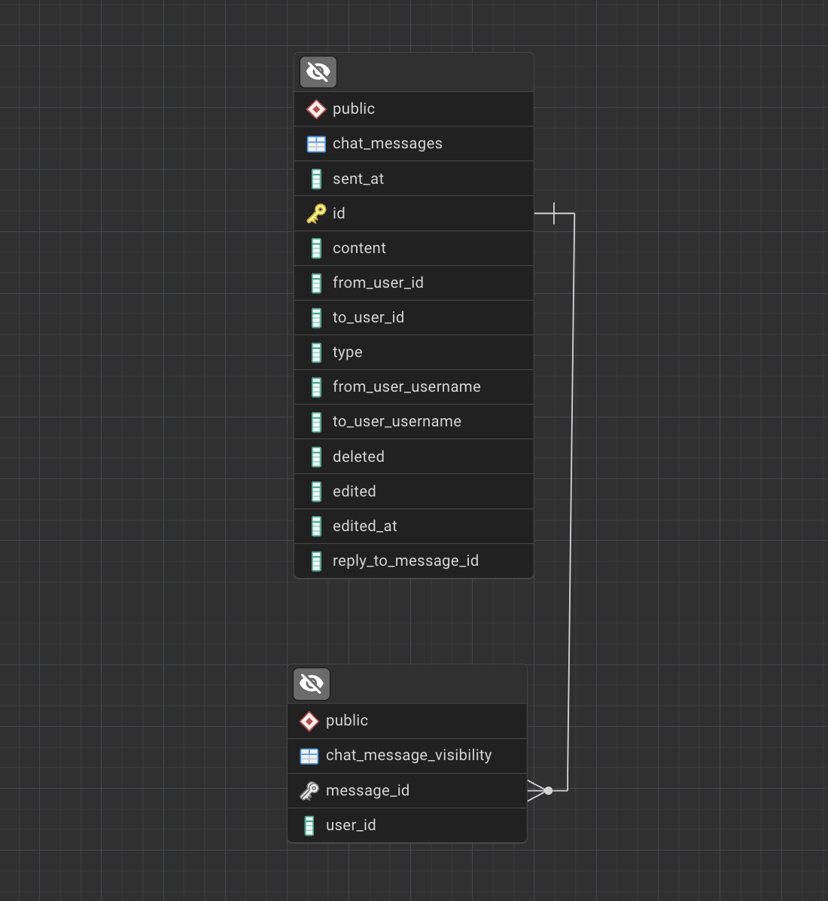

# Database – SyntaxBase

This document provides an overview of the **database design** used in **SyntaxBase**, including schema organization, entity relationships and data flows between services.

The system currently uses two databases: `baza` and `SyntaxBaseChat`. Both play a crucial role in storing and persisting information about users, their actions and application state.

## Database Technology

- **PostgreSQL** – the relational database used for SyntaxBase, selected for its reliability, performance and robust transactional support.
- **PgAdmin 4** – graphical interface used for database management, schema inspection and query execution.

## High-Level Schema Overview

The database schema supports **core platform features** such as courses, user management, chat, notifications and forum.  
Each microservice interacts with **dedicated tables** while sharing a common PostgreSQL instance.

## ER Diagram of Database

This section will provide ER diagram for both `baza` and `SyntaxBaseChat` database.

### ER diagram of `baza`

---

### ER diagram of `SyntaxBaseChat` (work in progress)

---

## Tables (baza database)

This section documents all `baza` database tables used in the primary backend and the notification microservice. It provides an overview of their structure, purpose relationships.

## badge

| Column | Type | Nullable | Default |
|--------|------|----------|---------|
| id | uuid | NO |  |
| criteria | text | YES |  |
| description | character varying | YES |  |
| name | character varying | NO |  |
| status | boolean | YES |  |
| badge_type | character varying | NO |  |

## certificate

| Column | Type | Nullable | Default |
|--------|------|----------|---------|
| id | uuid | NO |  |
| file_url | character varying | YES |  |
| instructor_name | character varying | YES |  |
| issued_at | timestamp without time zone | YES |  |
| course_id | integer | YES |  |
| user_userid | integer | YES |  |

## contact_form

| Column | Type | Nullable | Default |
|--------|------|----------|---------|
| id | integer | NO |  |
| email | character varying | YES |  |
| message | character varying | YES |  |
| name | character varying | YES |  |
| phone | character varying | YES |  |
| surname | character varying | YES |  |
| username | character varying | YES |  |

## courses

| Column | Type | Nullable | Default |
|--------|------|----------|---------|
| id | integer | NO |  |
| category | character varying | YES |  |
| course_name | character varying | YES |  |
| description | character varying | YES |  |
| length | integer | NO |  |
| creator_id | integer | YES |  |
| system_course | boolean | YES |  |
| invite_token | uuid | YES |  |

## feedback_request

| Column | Type | Nullable | Default |
|--------|------|----------|---------|
| id | integer | NO |  |
| email | character varying | YES |  |
| message | character varying | YES |  |

## instructor_request

| Column | Type | Nullable | Default |
|--------|------|----------|---------|
| id | bigint | NO |  |
| address | character varying | YES |  |
| credentials | character varying | YES |  |
| decision_date | timestamp without time zone | YES |  |
| institution | character varying | YES |  |
| phone | character varying | YES |  |
| request_date | timestamp without time zone | YES |  |
| status | character varying | YES |  |
| user_userid | integer | YES |  |
| email | character varying | YES |  |

## invite_tokens

| Column | Type | Nullable | Default |
|--------|------|----------|---------|
| id | bigint | NO |  |
| expires_at | timestamp without time zone | YES |  |
| invited_by_user_id | character varying | YES |  |
| lesson_id | integer | YES |  |
| token | character varying | YES |  |
| used | boolean | NO |  |
| course_id | integer | YES |  |
| invited_email | character varying | YES |  |

## lesson

| Column | Type | Nullable | Default |
|--------|------|----------|---------|
| id | integer | NO |  |
| lesson_name | character varying | YES |  |
| course_id | integer | NO |  |
| user_id | integer | YES |  |
| completed | boolean | YES |  |
| content | character varying | YES |  |
| editable | boolean | YES |  |
| lesson_number_id | integer | YES |  |

## lesson_feedback

| Column | Type | Nullable | Default |
|--------|------|----------|---------|
| id | integer | NO |  |
| feedback | character varying | YES |  |
| lesson_id | integer | NO |  |
| user_id | integer | NO |  |

## notification

| Column | Type | Nullable | Default |
|--------|------|----------|---------|
| id | integer | NO |  |
| created_at | timestamp without time zone | YES |  |
| is_read | boolean | NO |  |
| message | character varying | YES |  |
| post_id | integer | YES |  |
| reply_id | integer | YES |  |
| user_id | character varying | YES |  |
| parent_user_email | character varying | YES |  |
| chat_message_id | uuid | YES |  |
| replier_user_email | character varying | YES |  |

## post

| Column | Type | Nullable | Default |
|--------|------|----------|---------|
| id | integer | NO |  |
| content | character varying | YES |  |
| created_at | timestamp without time zone | YES |  |
| deleted | boolean | NO |  |
| user_id | character varying | YES |  |
| parent_post_id | integer | YES |  |
| category | character varying | YES |  |
| updated_at | timestamp without time zone | YES |  |

## rating

| Column | Type | Nullable | Default |
|--------|------|----------|---------|
| id | bigint | NO |  |
| course_id | bigint | YES |  |
| rating | integer | NO |  |
| auth0user_id | character varying | YES |  |

## reports

| Column | Type | Nullable | Default |
|--------|------|----------|---------|
| id | integer | NO |  |
| created_at | timestamp without time zone | YES |  |
| reason | text | NO |  |
| reporter_id | character varying | YES |  |
| resolved | boolean | NO |  |
| post_id | integer | NO |  |

## user_badge

| Column | Type | Nullable | Default |
|--------|------|----------|---------|
| id | uuid | NO |  |
| awarded_at | timestamp without time zone | YES |  |
| progress | oid | YES |  |
| revoke_status | boolean | YES |  |
| badge_id | uuid | NO |  |
| user_id | integer | NO |  |

## user_courses

| Column | Type | Nullable | Default |
|--------|------|----------|---------|
| id | integer | NO |  |
| course_id | integer | NO |  |
| user_id | integer | NO |  |
| completed | boolean | YES |  |

## user_progress

| Column | Type | Nullable | Default |
|--------|------|----------|---------|
| id | integer | NO |  |
| course_id | integer | NO |  |
| current_lesson_id | integer | YES |  |
| user_id | integer | NO |  |

## user_roles

| Column | Type | Nullable | Default |
|--------|------|----------|---------|
| user_id | integer | NO |  |
| role | character varying | YES |  |

## users

| Column | Type | Nullable | Default |
|--------|------|----------|---------|
| userid | integer | NO |  |
| date_created | timestamp without time zone | NO |  |
| name | character varying | NO |  |
| password | character varying | NO |  |
| surname | character varying | NO |  |
| username | character varying | NO |  |
| role | character varying | YES |  |
| auth0user_id | character varying | YES |  |
| active | boolean | NO |  |
| tier | character varying | NO | 'FREE'::character varying |

## Tables (SyntaxBaseChat database)

## chat_messages
| Column | Type | Nullable | Default |
|--------|------|----------|---------|
| sent_at | timestamp without time zone | NO |  |
| id | uuid | NO |  |
| content | character varying | NO |  |
| from_user_id | character varying | NO |  |
| to_user_id | character varying | NO |  |
| type | character varying | NO |  |
| from_user_username | character varying | YES |  |
| to_user_username | character varying | YES |  |
| deleted | boolean | NO |  |
| edited | boolean | NO |  |
| edited_at | timestamp without time zone | NO |  |
| reply_to_message_id | uuid | NO | |

## chat_messages_visibility

| Column | Type | Nullable | Default |
|--------|------|----------|---------|
| message_id | integer | NO |  |
| user_id | string | NO |  |

## Data Flows

### Example 1: User Progress Tracking

- User completes a lesson in the frontend.
- Backend writes record into `lesson_progress`.
- Aggregated course completion percentage is calculated in real time.

--- 

### Example 2: Forum Post with Notifications

- User posts a reply → stored in `replies`.
- Backend publishes event to Kafka topic `forum.reply.created`.
- Notification microservice inserts record into `notifications` table.
- Record is pushed via WebSocket to the recipient.

---

### Example 3: User Authentication & Session Handling
- User logs in through the frontend.  
- Auth request sent to backend via **REST API**.  
- Backend validates credentials with **Auth0 / JWT**.  
- A valid session token is returned and stored in frontend state.  
- Token is later refreshed automatically using custom React hooks.  

---

### Example 4: Real-Time Chat Messaging
- User sends a chat message in the UI.  
- Backend **Chat Microservice** stores the message in `chat_messages` table.  
- Kafka event `chat.messages` is published.  
- Notification microservice consumes the event, updating `notifications` table for unread messages.  
- WebSocket pushes live update to the recipient.  

---

### Example 5: Course Enrollment
- User enrolls in a course from the frontend.  
- Backend stores enrollment in `user_courses`.  
- Kafka event `course.enrollment.created` is published (planned).  
- Analytics service (planned) consumes event for reporting.

## Database Overview – SyntaxBase

SyntaxBase uses **two databases**:

| Database Name       | Purpose / Current Use                          | Planned Enhancements                          |
|--------------------|-----------------------------------------------|-----------------------------------------------|
| `baza`             | Core database: users, courses, forum content etc. | Indexing and partitioning for large tables; schema evolution via migrations |
| `SyntaxBaseChat`   | Chat microservice: messages, notifications    | Gradual expansion for new chat features; optimized queries for high throughput |

### Key Characteristics

- **Normalized structure** – avoids data redundancy and maintains consistency.  
- **Clear entity relationships** – foreign keys and constraints enforce integrity.  
- **Transactional consistency** – ensures ACID-compliant operations for critical data.  
- **Scalability (planned)** – indexing, partitioning performance optimization for high-volume tables.  
- **Schema evolution (planned)** – migrations for reproducible and maintainable schema updates across environments.