# SyntaxBase Documentation

This document serves as a **centralized documentation reference** for all aspects of **SyntaxBase**, combining project overview, tech stack, architecture, database design, usage instructions, testing and future work.
You can consider this as a master documentation file that consolidates the contents of:

- `PROJECT_OVERVIEW.md`
- `TECH_STACK.md`
- `ARCHITECTURE.md`
- `DATABASE.md`
- `USAGE.md`
- `TESTING.md`
- `FUTURE_WORK.md`


# Project Overview – SyntaxBase

This document provides an overview of the **SyntaxBase** project, including the problems it addresses, its core goals, key features and planned next steps for future development.

## What is SyntaxBase?

**SyntaxBase** is a full-stack learning and collaboration platform that combines structured educational content with real-time interaction and community features.  
The project showcases a **microservices architecture** powered by **Spring Boot**, **React**, **Kafka**, **WebSockets** and **PostgreSQL**, all wrapped in **Dockerized deployments**.


## Core Learning Sections

SyntaxBase provides a wide range of tutorials, exercises and interactive content organized into **five core domains**:

- **Web Development**
- **Game Development**
- **Database Management**
- **Problem Solving**
- **Instructions & Lectures**

Each domain is structured into **three tiers**—**Beginner**, **Intermediate** and **Advanced**—to guide learners through progressive skill levels.


## Community Features

Beyond learning materials, SyntaxBase offers collaboration through an integrated **community forum** where users can:

- **Engage in discussions** – threaded forum with topic sections, message editing and user profile previews.
- **Connect with peers** – one-to-one chat and discovery of other developers and tech enthusiasts.
- **Share feedback** – receive guidance from instructors or collaborate with fellow learners.


## Problem It Solves

Many e-learning and collaboration platforms face common challenges:
- Limited **real-time interaction** between participants.
- Tightly coupled architectures that make systems harder to extend.
- Fragmented user experience across chat, notifications and content delivery.
- Lack of a unified technical foundation to support both learning content and community features.

**SyntaxBase** approaches these challenges by:
- Introducing **WebSockets** for live notifications and chat.
- Using **Kafka** to demonstrate event-driven, decoupled communication between services.
- Structuring the backend into **modular microservices** rather than a monolith.
- Combining a **modern UI (React)** with a reliable **backend core (Spring Boot + PostgreSQL)**.

*Note: While the architecture is designed with scalability in mind, the primary goal of this project is to demonstrate modern engineering practices, experiment with new technologies and provide a complete end-to-end system. Production-grade performance testing has not been performed, but future work and commits may include scalability testing and optimization.*

## Goals of the Project

1. **Demonstrate modular and scalable architecture** with microservices, message queues and real-time connections.
2. **Provide a complete end-to-end app** — backend, frontend, database, communication middleware and deployment pipeline.
3. **Serve as a flagship portfolio project**, showcasing good engineering practices (layered backend design, unit testing, Dockerization).
4. **Highlight advanced features** such as event-driven communication and live user interactions.


## Key Features

- **User Authentication & Management** – registration, login, role-based access
- **Real-time Chat** – WebSocket-based messaging between users
- **Live Notifications** – Kafka + WebSockets power event-driven updates
- **Content / Lesson Management** – courses, lessons and structured content delivery
- **Collaboration Tools** – interaction features for students and teachers
- **Scalable Microservices** – modular backend services that can be extended independently
- **Dockerized Deployment** – simplified setup with containers
- **Unit Tests** – validation of backend services and core flows

*(In [FEATURES_OVERVIEW.md](./FEATURES_OVERVIEW.md), screenshots illustrate these features in detail.)*


## Next Steps

- Explore scalability improvements, including load balancing and Kafka partitioning.
- Add advanced learning features such as grading and analytics.
- Enhance observability with improved monitoring, logging and metrics.
- Refine UX/UI for smoother workflows and better user experience.

### Future Community Enhancements
- Implement forum comment moderation with a separate NLP module for detecting and handling toxic content.
- Integrate AI-assisted comment classification to help administrators manage user interactions more effectively.

# Tech Stack – SyntaxBase

This document provides a detailed overview of the technologies used in **SyntaxBase**, along with reasoning for each choice. The stack was selected to demonstrate good engineering practices, event-driven architectures, real-time communication and full-stack integration.


## Backend

- **Spring Boot**  
  Reliable and widely used Java framework for building RESTful APIs and microservices. Provides dependency injection, security integration and modular structure. Ideal for demonstrating layered architecture (controllers, services, repositories).

- **Kafka**  
  Event streaming platform used for asynchronous communication between microservices. Enables decoupling of services and supports real-time notifications. Demonstrates event-driven architecture principles.

- **WebSockets**  
  Provides real-time bi-directional communication between server and client. Used for chat and live notifications, enhancing interactivity.

- **PostgreSQL**  
  Relational database with strong consistency guarantees. Stores structured data for users, messages, notifications, courses and forum content. Chosen for reliability and compatibility with Spring Data JPA.


## Frontend

- **React**  
  Component-based JavaScript library for building dynamic and responsive user interfaces. Enables modular UI development and state management, making it easier to maintain and extend.


## DevOps / Deployment

- **Docker**  
  Containerization platform used to package backend services, frontend, database and microservice components. Ensures consistent environments for development, testing and deployment.

- **GitHub Actions**  
  CI/CD workflow used to automatically build and test the application on every commit. Ensures code quality and maintains reproducible builds.


## Testing

- **JUnit**  
  Unit testing framework for Java backend services. Used to validate business logic and service layer functionality.

- **Mockito**  
  Mocking framework for Java, used in conjunction with JUnit to isolate units during testing.


## Communication & Architecture

- **REST APIs**  
  Used for communication between frontend and backend services, providing CRUD operations and structured data exchange.

- **Kafka Topics**  
  Channels for asynchronous event messaging, such as notifications or chat events, decoupling service interactions.

- **WebSocket Channels**  
  Real-time push updates for chat and notifications, enabling instant user feedback.


## Additional Tools

- **Maven**  
  Java build and dependency management tool, used to manage Spring Boot backend modules.

- **Node.js / npm**  
  Frontend package management and build system for React.

- **Visual Studio Code / IntelliJ IDEA**  
  IDEs used for frontend and backend development.

- **Git**  
  Version control system used for source code management, branching and committing changes to GitHub. Enables collaboration and keeps project history organized.

- **Postman**  
  API testing and exploration tool used to test REST endpoints, validate responses and catch bugs during development.

- **curl**  
  Command-line tool for testing and interacting with backend services and REST APIs directly, useful for quick verification of endpoints.

- **pgAdmin4**  
  PostgreSQL administration tool used to manage, query and visualize the database schema and data.


### Why This Stack?

The stack was chosen to demonstrate modern, full-stack development practices while supporting the architectural goals of SyntaxBase.

- **Spring Boot** and **PostgreSQL** provide a reliable backend foundation with clear separation of concerns and support for data consistency.
- **React** enables a dynamic, modular frontend with reusable components and maintainable state management.
- **Kafka** and **WebSockets** allow real-time communication and event-driven design between microservices.
- **Docker** ensures consistent environments across development, testing and deployment.

This combination of technologies allows the project to showcase **modular and maintainable engineering practices** while also providing a platform to learn and experiment with new technologies.


# Architecture – SyntaxBase

This document describes the architecture of **SyntaxBase**, including its high-level system design, service responsibilities, backend/frontend structure and communication flows.

## High-Level System Design

The platform follows a **microservices-based architecture**, deployed in a containerized environment with **Docker**.  
Services communicate primarily through **REST APIs**, with asynchronous flows handled by **Kafka** and real-time updates powered by **WebSockets**.

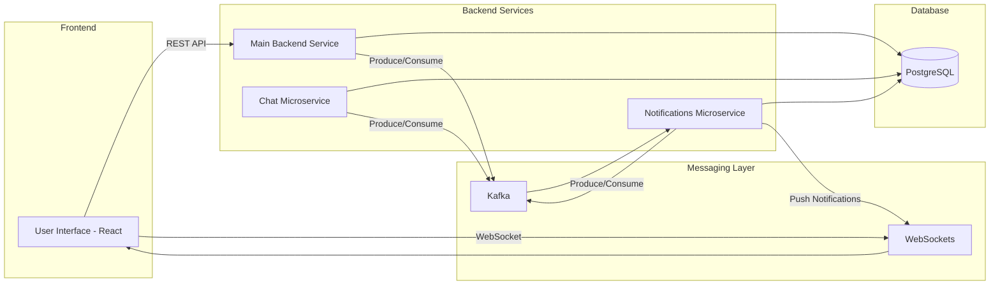

## Microservices Breakdown

- **Main Backend Service**
    - Spring Boot project
    - Core business logic: user management, courses, forum content and many more
    - Interacts with Chat and Notification microservices via Kafka
    - Reads/writes to PostgreSQL tables: users, posts, courses, forum and many more

- **Notification Microservice**
    - Spring Boot project
    - Responsible for real-time notifications
    - Users notified for:
        - reply on forum post
        - unread chat messages
    - Subscribes to Kafka topics for events
    - Pushes updates via WebSockets

- **Chat Microservice**
    - Spring Boot project
    - Real-time chat messaging between users
    - Subscribes to Kafka topics
    - Notifies Notification microservice about unread messages

- **Shared Microservice**
    - Spring Boot project
    - Contains shared DTOs for chat messages, notifications, etc.
    - Ensures consistency and reduces tight coupling

## Backend Structure

The backend is built with **Spring Boot** and follows a **layered architecture**:

- **Configuration** – centralizes application setup: exception handling, Kafka producer configs, security, payment options, logging etc.
- **Controllers** – expose REST endpoints; validate requests; call Services
- **Services** – core business logic; orchestrate Repositories, other microservices and external systems
- **Repositories (DAO)** – isolate database access using Spring Data JPA for loose coupling
- **DTOs (Data Transfer Objects)** – clean transfer of data between layers and services
- **Validation Layer** – ensures incoming requests meet criteria using annotations and custom validators

The backend of **SyntaxBase** follows a **layered architecture**, where each layer has a distinct responsibility. This structure ensures clean separation of concerns, easier maintenance and consistent flow of data. Above mentioned configuration is displayed in the diagram below.


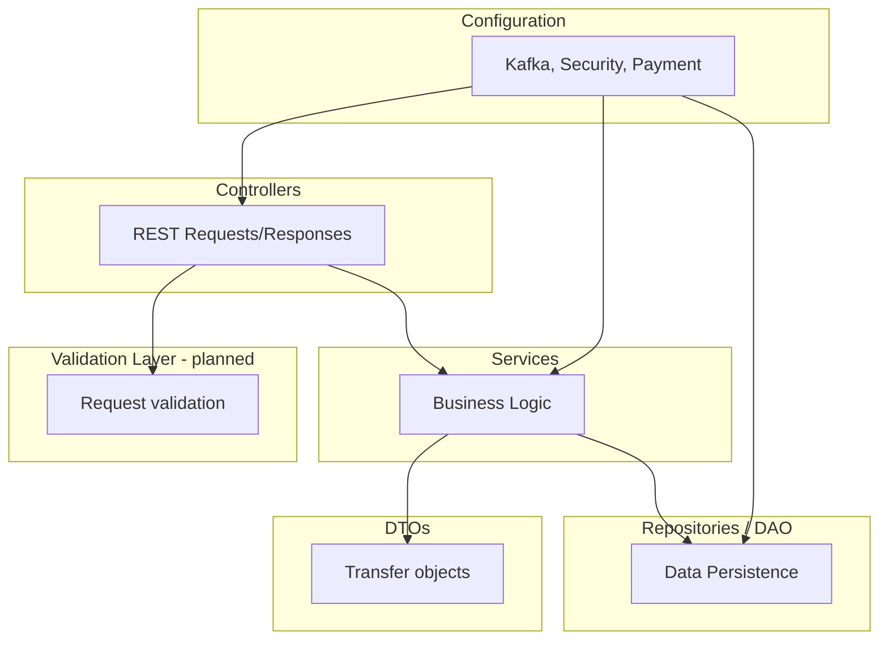

*Note: A dedicated validation layer is planned for future iterations to centralize and enforce data validation systematically.*

## Frontend Structure

The frontend of **SyntaxBase** is built with **React** and designed for modularity, reusability and maintainability.  
It interacts with backend services via **REST APIs** and receives real-time updates through **WebSockets**.

Description of Frontend Layers: 

- **Components**: Reusable UI elements like forms, chat windows, course pages, buttons etc.

- **Functions** – legacy helper functions kept for backward compatibility (planned for refactor/removal)

- **Hooks** – custom React hooks for session management and token lifecycle, including automatic checking of token expiration and refreshing via backend calls.

- **Images** – static assets used in the frontend, such as icons, illustrations and images displayed in course content, notifications and UI components. Used to maintain visual consistency and separates assets from logic.

- **Models / Types** – TypeScript interfaces, types and helper constants that define the shape of data objects (e.g., Notification, User, Tier) and standardize usage across components and services.

- **Pages**: Organized by course type (Database, Game, Problem Solving, Web etc.), user role, plus authentication and forum to display content.

- **Services**: Handles communication with the micorservices using REST APIs and real-time updates with WebSockets.

- **Styles**: CSS or SCSS modules for styling components and pages consistently.

- **Utilities / Helpers**: Contains shared helper functions and utility modules used across components and pages.

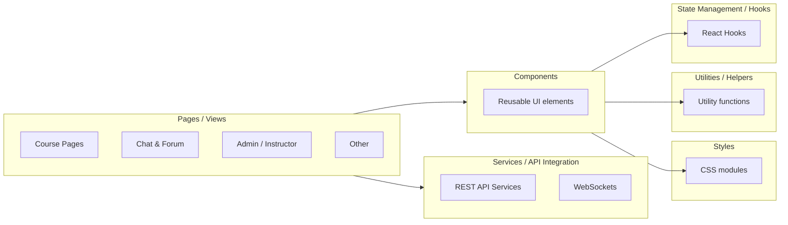


## Communication Flows

SyntaxBase combines multiple communication patterns to balance **reliability**, **responsiveness** and **decoupling**.  
The platform uses **REST APIs** for synchronous calls, **Kafka topics** for asynchronous microservice events and **WebSockets** for real-time updates.

### Patterns Overview

- **REST APIs** – synchronous request/response pattern between **frontend pages/components** and **backend services**. Used for CRUD operations like user registration, login, course content retrieval and updates.
- **Kafka Topics** – asynchronous, event-driven communication between **microservices**, allowing decoupling. Example: when a new forum post reply is created, a message is published to Kafka, which the Notification microservice consumes.
- **WebSockets** – push-based, real-time updates from backend to frontend. Used for live chat, notifications or dynamic content updates without polling.

### Example Scenario

1. User posts a reply to post on a forum.  
2. Frontend calls backend via **REST API** to save the post.  
3. Backend publishes an event to **Kafka topic** `forum.reply.created`.  
4. Notification microservice consumes the event and pushes a notification to all relevant users via **WebSocket**.

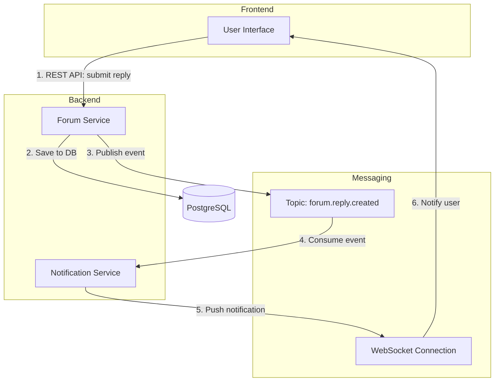

## Summary

The **SyntaxBase architecture** demonstrates full-stack approach combining **microservices**, **layered backend design** and **modular frontend structure**. Key points include:

- **Scalable Microservices** – separate services for core backend, chat, notifications and shared DTOs ensure loose coupling and maintainability.  
- **Layered Backend** – configuration, controllers, services, repositories and DTOs provide a clear separation of concerns and facilitate testing and evolution of business logic.  
- **Modular Frontend** – React components, pages, hooks, services, utilities and styles enable reusable and maintainable code, with REST APIs and WebSockets for real-time interaction.  
- **Hybrid Communication Patterns** – REST for synchronous CRUD operations, Kafka for asynchronous event-driven messaging and WebSockets for push notifications and chat, balancing responsiveness, reliability and decoupling.  
- **End-to-End Flow** – example scenarios (forum replies, notifications) illustrate how data moves through the system from frontend action to backend persistence, microservice events and user notification.  

This architecture is designed to **showcase good engineering practices**, support **future scalability** and provide a clear, maintainable structure suitable for learning, collaboration and potential extension to production-grade systems.

# Database – SyntaxBase

This document provides an overview of the **database design** used in **SyntaxBase**, including schema organization, entity relationships and data flows between services.

The system currently uses two databases: `baza` and `SyntaxBaseChat`. Both play a crucial role in storing and persisting information about users, their actions and application state.

## Database Technology

- **PostgreSQL** – the relational database used for SyntaxBase, selected for its reliability, performance and robust transactional support.
- **PgAdmin 4** – graphical interface used for database management, schema inspection and query execution.

## High-Level Schema Overview

The database schema supports **core platform features** such as courses, user management, chat, notifications and forum.  
Each microservice interacts with **dedicated tables** while sharing a common PostgreSQL instance.

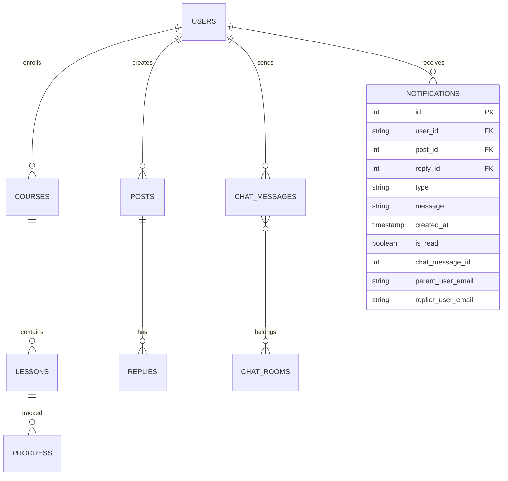

## ER Diagram of Database

This section will provide ER diagram for both `baza` and `SyntaxBaseChat` database.

### ER diagram of `baza`

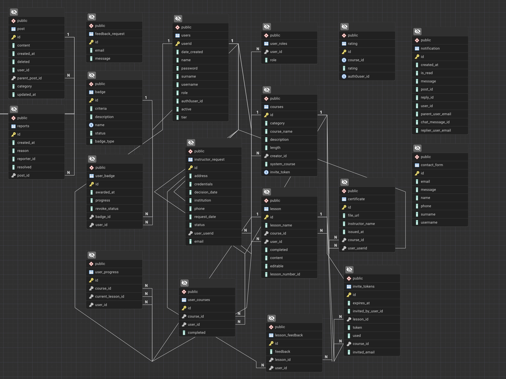


### ER diagram of `SyntaxBaseChat` (work in progress)

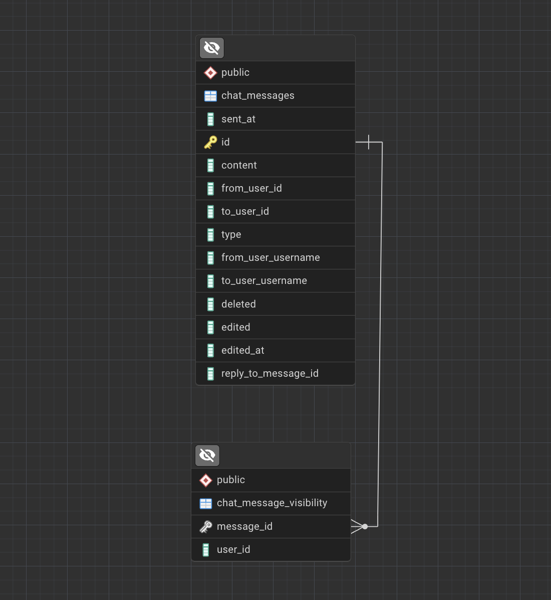


## Tables (baza database)

This section documents all `baza` database tables used in the primary backend and the notification microservice. It provides an overview of their structure, purpose relationships.

## badge

| Column | Type | Nullable | Default |
|--------|------|----------|---------|
| id | uuid | NO |  |
| criteria | text | YES |  |
| description | character varying | YES |  |
| name | character varying | NO |  |
| status | boolean | YES |  |
| badge_type | character varying | NO |  |

## certificate

| Column | Type | Nullable | Default |
|--------|------|----------|---------|
| id | uuid | NO |  |
| file_url | character varying | YES |  |
| instructor_name | character varying | YES |  |
| issued_at | timestamp without time zone | YES |  |
| course_id | integer | YES |  |
| user_userid | integer | YES |  |

## contact_form

| Column | Type | Nullable | Default |
|--------|------|----------|---------|
| id | integer | NO |  |
| email | character varying | YES |  |
| message | character varying | YES |  |
| name | character varying | YES |  |
| phone | character varying | YES |  |
| surname | character varying | YES |  |
| username | character varying | YES |  |

## courses

| Column | Type | Nullable | Default |
|--------|------|----------|---------|
| id | integer | NO |  |
| category | character varying | YES |  |
| course_name | character varying | YES |  |
| description | character varying | YES |  |
| length | integer | NO |  |
| creator_id | integer | YES |  |
| system_course | boolean | YES |  |
| invite_token | uuid | YES |  |

## feedback_request

| Column | Type | Nullable | Default |
|--------|------|----------|---------|
| id | integer | NO |  |
| email | character varying | YES |  |
| message | character varying | YES |  |

## instructor_request

| Column | Type | Nullable | Default |
|--------|------|----------|---------|
| id | bigint | NO |  |
| address | character varying | YES |  |
| credentials | character varying | YES |  |
| decision_date | timestamp without time zone | YES |  |
| institution | character varying | YES |  |
| phone | character varying | YES |  |
| request_date | timestamp without time zone | YES |  |
| status | character varying | YES |  |
| user_userid | integer | YES |  |
| email | character varying | YES |  |

## invite_tokens

| Column | Type | Nullable | Default |
|--------|------|----------|---------|
| id | bigint | NO |  |
| expires_at | timestamp without time zone | YES |  |
| invited_by_user_id | character varying | YES |  |
| lesson_id | integer | YES |  |
| token | character varying | YES |  |
| used | boolean | NO |  |
| course_id | integer | YES |  |
| invited_email | character varying | YES |  |

## lesson

| Column | Type | Nullable | Default |
|--------|------|----------|---------|
| id | integer | NO |  |
| lesson_name | character varying | YES |  |
| course_id | integer | NO |  |
| user_id | integer | YES |  |
| completed | boolean | YES |  |
| content | character varying | YES |  |
| editable | boolean | YES |  |
| lesson_number_id | integer | YES |  |

## lesson_feedback

| Column | Type | Nullable | Default |
|--------|------|----------|---------|
| id | integer | NO |  |
| feedback | character varying | YES |  |
| lesson_id | integer | NO |  |
| user_id | integer | NO |  |

## notification

| Column | Type | Nullable | Default |
|--------|------|----------|---------|
| id | integer | NO |  |
| created_at | timestamp without time zone | YES |  |
| is_read | boolean | NO |  |
| message | character varying | YES |  |
| post_id | integer | YES |  |
| reply_id | integer | YES |  |
| user_id | character varying | YES |  |
| parent_user_email | character varying | YES |  |
| chat_message_id | uuid | YES |  |
| replier_user_email | character varying | YES |  |

## post

| Column | Type | Nullable | Default |
|--------|------|----------|---------|
| id | integer | NO |  |
| content | character varying | YES |  |
| created_at | timestamp without time zone | YES |  |
| deleted | boolean | NO |  |
| user_id | character varying | YES |  |
| parent_post_id | integer | YES |  |
| category | character varying | YES |  |
| updated_at | timestamp without time zone | YES |  |

## rating

| Column | Type | Nullable | Default |
|--------|------|----------|---------|
| id | bigint | NO |  |
| course_id | bigint | YES |  |
| rating | integer | NO |  |
| auth0user_id | character varying | YES |  |

## reports

| Column | Type | Nullable | Default |
|--------|------|----------|---------|
| id | integer | NO |  |
| created_at | timestamp without time zone | YES |  |
| reason | text | NO |  |
| reporter_id | character varying | YES |  |
| resolved | boolean | NO |  |
| post_id | integer | NO |  |

## user_badge

| Column | Type | Nullable | Default |
|--------|------|----------|---------|
| id | uuid | NO |  |
| awarded_at | timestamp without time zone | YES |  |
| progress | oid | YES |  |
| revoke_status | boolean | YES |  |
| badge_id | uuid | NO |  |
| user_id | integer | NO |  |

## user_courses

| Column | Type | Nullable | Default |
|--------|------|----------|---------|
| id | integer | NO |  |
| course_id | integer | NO |  |
| user_id | integer | NO |  |
| completed | boolean | YES |  |

## user_progress

| Column | Type | Nullable | Default |
|--------|------|----------|---------|
| id | integer | NO |  |
| course_id | integer | NO |  |
| current_lesson_id | integer | YES |  |
| user_id | integer | NO |  |

## user_roles

| Column | Type | Nullable | Default |
|--------|------|----------|---------|
| user_id | integer | NO |  |
| role | character varying | YES |  |

## users

| Column | Type | Nullable | Default |
|--------|------|----------|---------|
| userid | integer | NO |  |
| date_created | timestamp without time zone | NO |  |
| name | character varying | NO |  |
| password | character varying | NO |  |
| surname | character varying | NO |  |
| username | character varying | NO |  |
| role | character varying | YES |  |
| auth0user_id | character varying | YES |  |
| active | boolean | NO |  |
| tier | character varying | NO | 'FREE'::character varying |


## Tables (SyntaxBaseChat database)

## chat_messages
| Column | Type | Nullable | Default |
|--------|------|----------|---------|
| sent_at | timestamp without time zone | NO |  |
| id | uuid | NO |  |
| content | character varying | NO |  |
| from_user_id | character varying | NO |  |
| to_user_id | character varying | NO |  |
| type | character varying | NO |  |
| from_user_username | character varying | YES |  |
| to_user_username | character varying | YES |  |
| deleted | boolean | NO |  |
| edited | boolean | NO |  |
| edited_at | timestamp without time zone | NO |  |
| reply_to_message_id | uuid | NO | |

## chat_messages_visibility

| Column | Type | Nullable | Default |
|--------|------|----------|---------|
| message_id | integer | NO |  |
| user_id | string | NO |  |

## Data Flows

### Example 1: User Progress Tracking

- User completes a lesson in the frontend.
- Backend writes record into `lesson_progress`.
- Aggregated course completion percentage is calculated in real time.

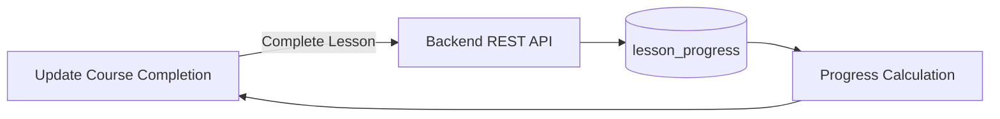
--- 

### Example 2: Forum Post with Notifications

- User posts a reply → stored in `replies`.
- Backend publishes event to Kafka topic `forum.reply.created`.
- Notification microservice inserts record into `notifications` table.
- Record is pushed via WebSocket to the recipient.

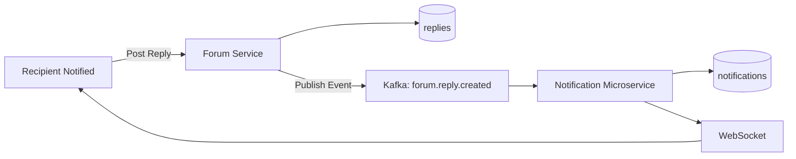

---

### Example 3: User Authentication & Session Handling
- User logs in through the frontend.  
- Auth request sent to backend via **REST API**.  
- Backend validates credentials with **Auth0 / JWT**.  
- A valid session token is returned and stored in frontend state.  
- Token is later refreshed automatically using custom React hooks.  

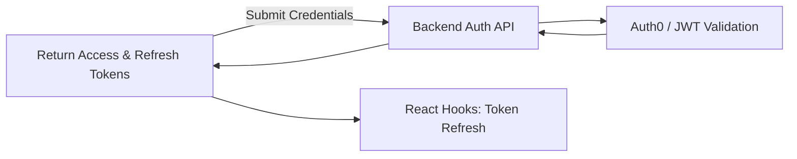

---

### Example 4: Real-Time Chat Messaging
- User sends a chat message in the UI.  
- Backend **Chat Microservice** stores the message in `chat_messages` table.  
- Kafka event `chat.messages` is published.  
- Notification microservice consumes the event, updating `notifications` table for unread messages.  
- WebSocket pushes live update to the recipient.  

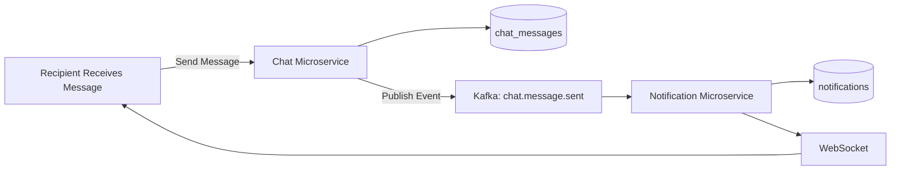

---

### Example 5: Course Enrollment
- User enrolls in a course from the frontend.  
- Backend stores enrollment in `user_courses`.  
- Kafka event `course.enrollment.created` is published (planned).  
- Analytics service (planned) consumes event for reporting.

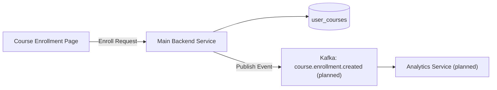


## Database Overview – SyntaxBase

SyntaxBase uses **two databases**:

| Database Name       | Purpose / Current Use                          | Planned Enhancements                          |
|--------------------|-----------------------------------------------|-----------------------------------------------|
| `baza`             | Core database: users, courses, forum content etc. | Indexing and partitioning for large tables; schema evolution via migrations |
| `SyntaxBaseChat`   | Chat microservice: messages, notifications    | Gradual expansion for new chat features; optimized queries for high throughput |

### Key Characteristics

- **Normalized structure** – avoids data redundancy and maintains consistency.  
- **Clear entity relationships** – foreign keys and constraints enforce integrity.  
- **Transactional consistency** – ensures ACID-compliant operations for critical data.  
- **Scalability (planned)** – indexing, partitioning performance optimization for high-volume tables.  
- **Schema evolution (planned)** – migrations for reproducible and maintainable schema updates across environments.

# Usage – SyntaxBase

This document provides an overview of **how to use SyntaxBase** application, including setup instructions, running the application, accessing services and interacting with the frontend.

## Prerequisites

Before you begin, ensure you have the following installed on your machine:

### Frontend
- [Node.js](https://nodejs.org/) (v18+ recommended)
- [npm](https://www.npmjs.com/) or [Yarn](https://yarnpkg.com/) (npm comes with Node.js)
- A modern web browser (e.g., Chrome, Firefox)

### Backend
- [Java JDK 17+](https://www.java.com/en/)
- [Maven](https://maven.apache.org/) (or Gradle, if your project uses it)
- [Spring Boot](https://spring.io/projects/spring-boot) (handled via Maven/Gradle)

### Database
- [PostgreSQL](https://www.postgresql.org/) (v14+ recommended)
  - Ensure a local or remote instance is running
  - Create a database and user with the proper privileges

### Optional (Recommended for Development)
- [Docker](https://www.docker.com/) (to run PostgreSQL easily)
- [Postman](https://www.postman.com/) for testing APIs
- [pgAdmin](https://www.pgadmin.org/) or another PostgreSQL client for database management

### Environment Setup

Since this is a side project, `.env` files and Spring Boot property files must be manually configured.  
Below is a guide for setting up the environment variables and properties for SyntaxBase. Project uses multiple `.env` files for maintenance and clarity, everything could be in one big .env file.

#### Root .env

Create `.env` file in root project:

```dotenv
POSTGRES_DB=your_database_name
POSTGRES_USER=your_user
POSTGRES_PASSWORD=your_password

# SyntaxBaseChat database for microservice-chat
SPRING_DATASOURCE_URL_CHAT=jdbc:postgresql://host.docker.internal:your_port/your_database_name
SPRING_DATASOURCE_USERNAME_CHAT=your_user
SPRING_DATASOURCE_PASSWORD_CHAT=your_password

# baza database for backend and other microservices
SPRING_DATASOURCE_URL=jdbc:postgresql://host.docker.internal:your_port/your_database_name
SPRING_DATASOURCE_USERNAME=your_user
SPRING_DATASOURCE_PASSWORD=your_password
```

#### 2. Frontend (.env)

Create a `.env` file in the `/frontend` folder:

```dotenv
REACT_APP_AUTH0_DOMAIN=your-auth0-domain
REACT_APP_AUTH0_CLIENT_ID=your-client-id
REACT_APP_AUTH0_AUDIENCE=your-api-audience
REACT_APP_AUTH0_ROLES_CLAIM=https://example.com/roles
REACT_APP_AUTH0_AUDIENCE=https://example/api/v2/
```

#### 3. Backend (Spring Boot) and microservices
Create `application.properties` and `application-secrets.properties` in `/resources` folder in backend and all microservices available

a) `application.properties` example

This file contains general configuration:

```dotenv
spring.config.import=classpath:application-secrets.properties
spring.jpa.properties.hibernate.dialect=org.hibernate.dialect.PostgreSQLDialect
spring.jpa.hibernate.ddl-auto=update

spring.jpa.show-sql=true
spring.jpa.generate-ddl=false
spring.thymeleaf.prefix=classpath:/templates/
spring.thymeleaf.suffix=.html

spring.datasource.url=${SPRING_DATASOURCE_URL}
spring.datasource.username=${SPRING_DATASOURCE_USERNAME}
spring.datasource.password=${SPRING_DATASOURCE_PASSWORD}
# email
spring.mail.host=smtp.gmail.com
spring.mail.port=465
spring.mail.properties.mail.smtp.auth=true
spring.mail.properties.mail.smtp.starttls.enable=false
spring.mail.properties.mail.smtp.ssl.enable=true

spring.kafka.bootstrap-servers=kafka:your_port
spring.kafka.producer.key-serializer=org.apache.kafka.common.serialization.StringSerializer
spring.kafka.producer.value-serializer=org.springframework.kafka.support.serializer.JsonSerializer

# Kafka
spring.kafka.bootstrap-servers=localhost:your_port_for_kafka
```
b) `application.properties-secrets` example

This file contains sensitive credentials and secrets:
```dotenv
auth0.audience=https://example.com/api/v2/
auth0.issuer=your_issuer
spring.security.oauth2.resourceserver.jwt.issuer-uri=https://example.com/
auth0.domain=your_domain.com
auth0.clientId=your_client_id
auth0.clientSecret=your_client_secret
auth0.redirectUri=http://your_redirect_uri/api/auth/callback
stripe.api.key=your_stripe_api_key
stripe.success.url=http://your_uri/success
stripe.cancel.url=http://your_uri/cancel
stripe.price.professional=your_professional_stripe_price
stripe.price.ultimate=your_ultimate_stripe_price
stripe.webhook.secret=your_webhook_secret
certificates.storage.path=your_storage_path

#email
spring.mail.username=yourEmail@example.com
spring.mail.password=your_password
```
*Note: application.properties imports the secrets file so that sensitive information is kept separate and not committed to version control:*

```dotenv
# In application.properties import
spring.config.import=optional:application.properties-secrets
```

### Development environment

For development environment VSCode and/or IntelijIDEA is recommended.

- Clone or download project
- Open project inside desired development environment

## Development Environment

The recommended integrated development environment (IDE) for this project is **IntelliJ IDEA**.

### Project Setup

1. **Clone or download** the repository from your version control system.
2. Open IntelliJ IDEA and navigate to:  
   `File → New → Project from Version Control...`
3. Paste the repository URL and select  
   **"Load Maven build script"** to import the project properly.

#### Screenshots
**Cloning the repository**


**Importing the project using Maven**


## Frontend setup

To launch the frontend application, follow these steps:

1. Open a terminal window inside **IntelliJ IDEA**/**VSCode** (or use your system terminal).
2. Navigate to the frontend directory:  
   `/SyntaxBase/frontend/src`
3. Install the dependencies:
   ```bash
   npm install
---
4. Start frontend
   ```bash
   npm start

#### Screenshots
**Installing dependencies**


**Starting frontend**


## Backend setup

To start the backend application, follow these steps:

1. Ensure that **Java 17** (or higher) is installed.
2. In IntelliJ, navigate to:  
   `SyntaxBase/backend/src/main/java/opp`
3. Locate the `BackendApplication.java` class.
4. Right-click the file and select **Run** to start the Spring Boot server.

#### Screenshot

*Running the Spring Boot application*


### Docker Deployment (Optional)
To make sure microservices work and are running you will have to set up Docker environment.
Without Docker, mutual chat and forum posts along with notification receiving won't be available.

1. Make sure Docker and Docker Compose are installed.  
2. Navigate to the root project folder with `docker-compose.yml`.  
3. Run the stack:
    ```bash
    docker-compose up --build
    ```
4. Services will start and the frontend will be accessible at `http://localhost:3000`.

## Accessing Databases

- **baza** – main backend database: users, courses, forum, etc.  
- **SyntaxBaseChat** – chat and notifications microservice database.  

You can query tables using `psql` or **PgAdmin4**. Navigate to `SyntaxBase/database` folder.

### To Restore `baza` use command:
```bash 
pg_restore -U postgres -h localhost -p 5432 -d baza_restored ./bazaDump.backup -v
```

*Note: database dump for `baza` is provided and accessible [here](../database/bazaDump.backup).*

### To Restore `SyntaxBaseChat` use command:
```bash
pg_restore -U postgres -h localhost -p 5432 -d SyntaxBaseChat_restored ./SyntaxBaseChat.backup -v
```

*Note: database dump for `SyntaxBaseChat` is provided and accessible [here](../database/SyntaxBaseChat.backup).*

---
*Note: Make sure to create `baza_restored` and `SyntaxBaseChat_restored` databases first, before executing above mentioned commands.*

## API Access

- **REST APIs** – available via backend services, e.g., `/api/users`, `/api/courses`.  
- **WebSockets** – real-time communication channels: `/ws-notifications`, `/ws-chat`.  

> Refer to the API documentation for detailed endpoint specifications, request/response formats and authentication requirements.


## Summary

This document provides **steps for using SyntaxBase**:

- Install prerequisites and dependencies.  
- Modify environment setup.
- Run backend services and frontend application.  
- Optionally, use Docker for a containerized setup to access microservices.
- Interact with users, courses, forum, chat and notifications.  
- Access databases for queries and management.  

# Testing – SyntaxBase

This document provides an overview of the **testing strategy** used in **SyntaxBase**, including types of tests, how to run them and coverage information.


## Types of Tests

SyntaxBase employs multiple layers of automated testing to ensure code quality, reliability and maintainability:

### 1. Unit Tests
- Focus on **individual components** or classes in isolation.
- Test **business logic** in backend services (Spring Boot)
- Examples:
  - Backend: validating service methods (e.g., calculating lesson progress, notification generation).

### 2. Integration Tests
- Verify **interaction between components**, services and external systems.
- Examples:
  - Backend: REST endpoints interacting with PostgreSQL using Spring Boot test context.
  - Kafka consumers and producers tested to ensure events propagate correctly.
  - WebSocket connections verified for real-time notifications.

### 3. Optional / Planned Tests
- End-to-end (E2E) testing is planned for future iterations using tools like **Cypress** or **Selenium**.

## Running Tests

### Backend (Spring Boot)

Navigate to /backend folder

Run all unit and integration tests using Maven:

```bash
mvn clean test
```
Test reports are generated in target/surefire-reports.

### To run a single test class:

```bash
mvn -Dtest=UserServiceTest test
```

### Microservice-chat (Spring Boot)

Navigate to /microservice-chat folder

Run all unit and integration tests using Maven:

```bash
mvn clean test
```
Test reports are generated in target/surefire-reports.

### To run a single test class:

```bash
mvn -Dtest=UserServiceTest test
```

### Microservice-notifications (Spring Boot)

Navigate to /microservice-notifications folder

Run all unit and integration tests using Maven:

```bash
mvn clean test
```
Test reports are generated in target/surefire-reports.

### To run a single test class:

```bash
mvn -Dtest=UserServiceTest test
```

## Test Coverage

### Backend (Spring Boot)

Coverage reports are generated via **JaCoCo** Maven plugin.

**Latest coverage metrics (2.10.2025.):**

| Metric    | Coverage |
|-----------|----------|
| Lines     | 94%      |
| Branches  | 82%      |
| Functions | 82%      |


> **Note:** Coverage percentages are indicative; they reflect the current test quality and can be updated after running tests.

## Summary

- **Unit tests** validate individual functions, methods and components in isolation.  
- **Integration tests** confirm that services, databases, Kafka topics and WebSockets interact correctly. 
- **Automated testing** ensures reliability, maintainability and consistent behavior across both backend and frontend.  
- **Coverage badges** provide quick visual insight evaluating project quality.  

# Future Work – SyntaxBase

This document outlines planned improvements, enhancements and potential new features for **SyntaxBase**. These items reflect areas of the system that can be expanded, optimized or refactored to improve performance, maintainability and user experience.


## Backend Improvements

- **Validation Layer**
  - Centralize input validation across services.
  - Ensure consistent data integrity using annotations and custom validators.

- **Additional Microservices**
  - Introduce analytics microservice for user activity tracking.
  - Add recommendation engine service for personalized course suggestions.
  
- **Performance & Scalability**
  - Optimize database queries with indexes and partitions.
  - Introduce caching layers (Redis or similar) for frequently accessed data.
  - Scale Kafka topics and consumers for higher throughput.

- **End-to-End Testing**
  - Implement E2E tests using **Cypress** or **Selenium**.
  - Automate real-world workflows across frontend and backend.


## Frontend Improvements

- **Refactor Legacy Functions**
  - Remove or modernize legacy utility functions for cleaner, modular code.
  
- **Component Library**
  - Consolidate reusable UI elements into a design system.
  - Enhance consistency and maintainability across pages.

- **Real-Time Enhancements**
  - Improve WebSocket handling for faster, more reliable notifications.
  - Optimize rendering for live chat and forum updates.
- **CSS scalability and responsiveness**
  - implement Tailwind CSS for mobility and responsiveness
  - remove hardcoded values for margins and paddings
  - overall UI improvements for responsiveness

## Database & Infrastructure

- **Database Optimization**
  - Add indexing and partitioning for high-volume tables.
  - Improve schema migration management for multi-environment consistency.

- **Monitoring & Observability**
  - Introduce metrics collection and logging for microservices.
  - Set up alerting and dashboards for system health.


## Potential New Features

- **Gamification**
  - Improved badges, achievements and progress tracking for course completion.
  
- **Social Features**
  - Improved forums, reactions and user interactions.
  
- **Toxic comment moderation**
  - moderate forums with new toxicity classifier
  - mark comments as inappropriate/for removal
  - give admins more control over user posts and replies

- **AI integration**
  - AI integration for course advertiesement
  - AI integration for course/tutorials/lessons summarization


## Future Work Summary

The **Future Work** roadmap focuses on **scalability, maintainability and feature enrichment**. These improvements will make SyntaxBase more robust, user-friendly and ready for future expansion.


## Documentation Summary

This documentation provides a **single source of documentation** for SyntaxBase.  

It is designed to be modular: each section can be updated independently and the content can also be split back into individual `.md` files if needed for better navigation or GitHub rendering.

