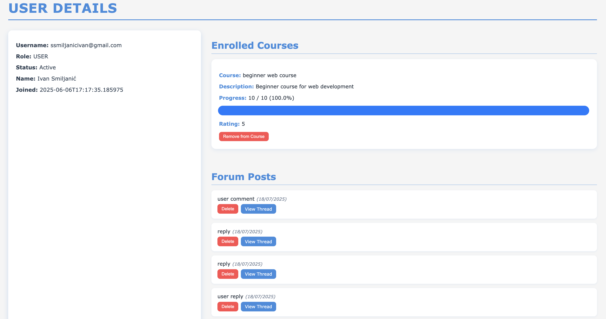
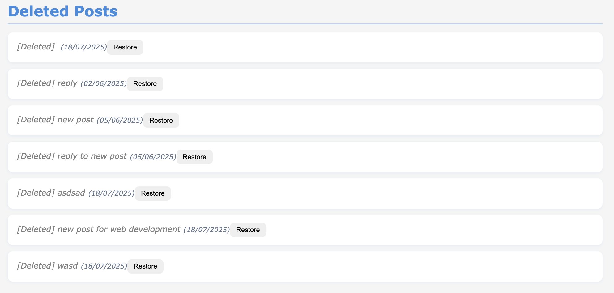

# Full Feature Walkthrough

## Demonstration
The following images provide a visual overview of some features and interface elements of the application.

---
### Homepage

### Courses on homepage

#### Web development course

#### Game development course

#### Database managment course

#### Problem solving course

#### Instructions and tutorials

### Tutorial example (initial lesson)

### Apply to course example

### Course example (initial)

### Auth login

### User homepage

### User information

### User notifications

### Instructor role request

### Created courses for instructor

### Admin instructor request

### Admin users display

### Admin user information display

### Admin courses display

### Admin reports display

### Deleted posts in admin user interface

### Tier upgrade options

### Payment via Stripe

### Forum sections

### Forum messages

### Invite link email

### Certificate email

### New notification email
