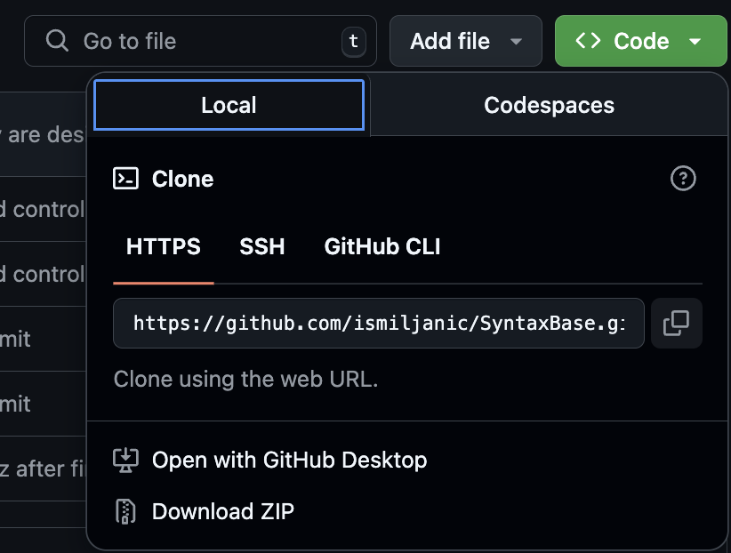
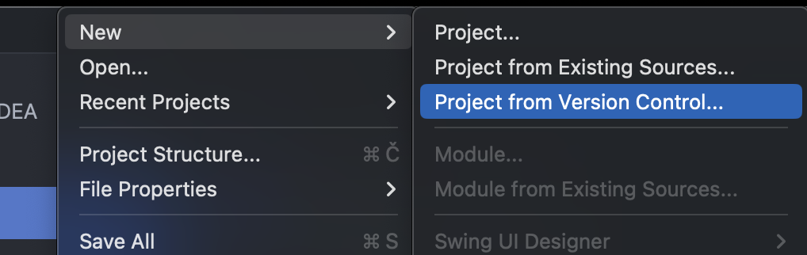
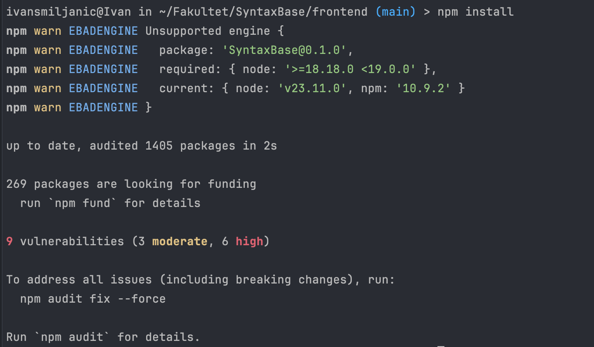
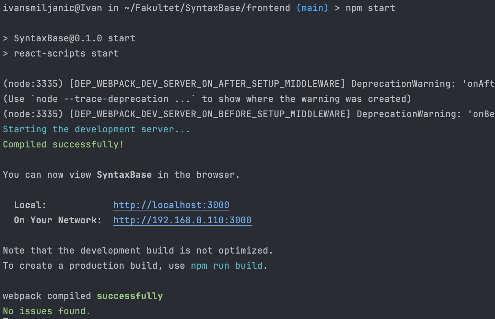
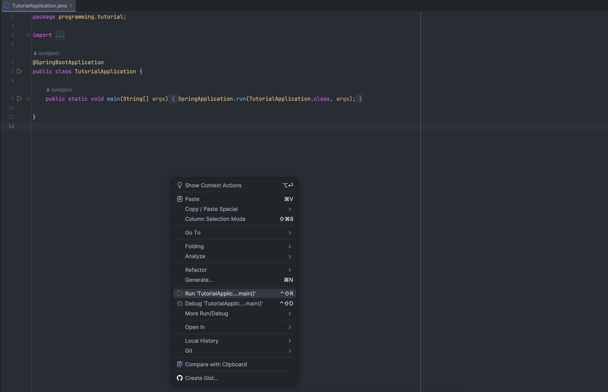

# Usage – SyntaxBase

This document provides an overview of **how to use SyntaxBase** application, including setup instructions, running the application, accessing services and interacting with the frontend.

---

## Prerequisites

Before you begin, ensure you have the following installed on your machine:

### Frontend
- [Node.js](https://nodejs.org/) (v18+ recommended)
- [npm](https://www.npmjs.com/) or [Yarn](https://yarnpkg.com/) (npm comes with Node.js)
- A modern web browser (e.g., Chrome, Firefox)

### Backend
- [Java JDK 17+](https://www.java.com/en/)
- [Maven](https://maven.apache.org/) (or Gradle, if your project uses it)
- [Spring Boot](https://spring.io/projects/spring-boot) (handled via Maven/Gradle)

### Database
- [PostgreSQL](https://www.postgresql.org/) (v14+ recommended)
  - Ensure a local or remote instance is running
  - Create a database and user with the proper privileges

### Optional (Recommended for Development)
- [Docker](https://www.docker.com/) (to run PostgreSQL easily)
- [Postman](https://www.postman.com/) for testing APIs
- [pgAdmin](https://www.pgadmin.org/) or another PostgreSQL client for database management

### Environment Setup

Since this is a side project, `.env` files and Spring Boot property files must be manually configured.  
Below is a guide for setting up the environment variables and properties for SyntaxBase. Project uses multiple `.env` files for maintenance and clarity, everything could be in one big .env file.

---

#### Root .env

Create `.env` file in root project:

```dotenv
POSTGRES_DB=your_database_name
POSTGRES_USER=your_user
POSTGRES_PASSWORD=your_password

# SyntaxBaseChat database for microservice-chat
SPRING_DATASOURCE_URL_CHAT=jdbc:postgresql://host.docker.internal:your_port/your_database_name
SPRING_DATASOURCE_USERNAME_CHAT=your_user
SPRING_DATASOURCE_PASSWORD_CHAT=your_password

# baza database for backend and other microservices
SPRING_DATASOURCE_URL=jdbc:postgresql://host.docker.internal:your_port/your_database_name
SPRING_DATASOURCE_USERNAME=your_user
SPRING_DATASOURCE_PASSWORD=your_password
```

#### 2. Frontend (.env)

Create a `.env` file in the `/frontend` folder:

```dotenv
REACT_APP_AUTH0_DOMAIN=your-auth0-domain
REACT_APP_AUTH0_CLIENT_ID=your-client-id
REACT_APP_AUTH0_AUDIENCE=your-api-audience
REACT_APP_AUTH0_ROLES_CLAIM=https://example.com/roles
REACT_APP_AUTH0_AUDIENCE=https://example/api/v2/
```

#### 3. Backend (Spring Boot) and microservices
Create `application.properties` and `application-secrets.properties` in `/resources` folder in backend and all microservices available

a) `application.properties` example

This file contains general configuration:

```dotenv
spring.config.import=classpath:application-secrets.properties
spring.jpa.properties.hibernate.dialect=org.hibernate.dialect.PostgreSQLDialect
spring.jpa.hibernate.ddl-auto=update

spring.jpa.show-sql=true
spring.jpa.generate-ddl=false
spring.thymeleaf.prefix=classpath:/templates/
spring.thymeleaf.suffix=.html

spring.datasource.url=${SPRING_DATASOURCE_URL}
spring.datasource.username=${SPRING_DATASOURCE_USERNAME}
spring.datasource.password=${SPRING_DATASOURCE_PASSWORD}
# email
spring.mail.host=smtp.gmail.com
spring.mail.port=465
spring.mail.properties.mail.smtp.auth=true
spring.mail.properties.mail.smtp.starttls.enable=false
spring.mail.properties.mail.smtp.ssl.enable=true

spring.kafka.bootstrap-servers=kafka:your_port
spring.kafka.producer.key-serializer=org.apache.kafka.common.serialization.StringSerializer
spring.kafka.producer.value-serializer=org.springframework.kafka.support.serializer.JsonSerializer

# Kafka
spring.kafka.bootstrap-servers=localhost:your_port_for_kafka
```
b) `application.properties-secrets` example

This file contains sensitive credentials and secrets:
```dotenv
auth0.audience=https://example.com/api/v2/
auth0.issuer=your_issuer
spring.security.oauth2.resourceserver.jwt.issuer-uri=https://example.com/
auth0.domain=your_domain.com
auth0.clientId=your_client_id
auth0.clientSecret=your_client_secret
auth0.redirectUri=http://your_redirect_uri/api/auth/callback
stripe.api.key=your_stripe_api_key
stripe.success.url=http://your_uri/success
stripe.cancel.url=http://your_uri/cancel
stripe.price.professional=your_professional_stripe_price
stripe.price.ultimate=your_ultimate_stripe_price
stripe.webhook.secret=your_webhook_secret
certificates.storage.path=your_storage_path

#email
spring.mail.username=yourEmail@example.com
spring.mail.password=your_password
```
*Note: application.properties imports the secrets file so that sensitive information is kept separate and not committed to version control:*

```dotenv
# In application.properties import
spring.config.import=optional:application.properties-secrets
```

### Development environment

For development environment VSCode and/or IntelijIDEA is recommended.

- Clone or download project
- Open project inside desired development environment
---
## Development Environment

The recommended integrated development environment (IDE) for this project is **IntelliJ IDEA**.

### Project Setup

1. **Clone or download** the repository from your version control system.
2. Open IntelliJ IDEA and navigate to:  
   `File → New → Project from Version Control...`
3. Paste the repository URL and select  
   **"Load Maven build script"** to import the project properly.

#### Screenshots
**Cloning the repository**



**Importing the project using Maven**



---
## Frontend setup

To launch the frontend application, follow these steps:

1. Open a terminal window inside **IntelliJ IDEA**/**VSCode** (or use your system terminal).
2. Navigate to the frontend directory:  
   `/SyntaxBase/frontend/src`
3. Install the dependencies:
   ```bash
   npm install
---
4. Start frontend
   ```bash
   npm start
---

#### Screenshots
**Installing dependencies**



**Starting frontend**



---
## Backend setup

To start the backend application, follow these steps:

1. Ensure that **Java 17** (or higher) is installed.
2. In IntelliJ, navigate to:  
   `SyntaxBase/backend/src/main/java/opp`
3. Locate the `BackendApplication.java` class.
4. Right-click the file and select **Run** to start the Spring Boot server.

#### Screenshot

*Running the Spring Boot application*



---

### Docker Deployment (Optional)
To make sure microservices work and are running you will have to set up Docker environment.
Without Docker, mutual chat and forum posts along with notification receiving won't be available.

1. Make sure Docker and Docker Compose are installed.  
2. Navigate to the root project folder with `docker-compose.yml`.  
3. Run the stack:
    ```bash
    docker-compose up --build
    ```
4. Services will start and the frontend will be accessible at `http://localhost:3000`.

---

## Accessing Databases

- **baza** – main backend database: users, courses, forum, etc.  
- **SyntaxBaseChat** – chat and notifications microservice database.  

You can query tables using `psql` or **PgAdmin4**. Navigate to `SyntaxBase/database` folder.

### To Restore `baza` use command:
```bash 
pg_restore -U postgres -h localhost -p 5432 -d baza_restored ./bazaDump.backup -v
```

*Note: database dump for `baza` is provided and accessible [here](../database/bazaDump.backup).*

### To Restore `SyntaxBaseChat` use command:
```bash
pg_restore -U postgres -h localhost -p 5432 -d SyntaxBaseChat_restored ./SyntaxBaseChat.backup -v
```

*Note: database dump for `SyntaxBaseChat` is provided and accessible [here](../database/SyntaxBaseChat.backup).*

---
*Note: Make sure to create `baza_restored` and `SyntaxBaseChat_restored` databases first, before executing above mentioned commands.*

## API Access

- **REST APIs** – available via backend services, e.g., `/api/users`, `/api/courses`.  
- **WebSockets** – real-time communication channels: `/ws-notifications`, `/ws-chat`.  

> Refer to the API documentation for detailed endpoint specifications, request/response formats and authentication requirements.

---

## Summary

This document provides **steps for using SyntaxBase**:

- Install prerequisites and dependencies.  
- Modify environment setup.
- Run backend services and frontend application.  
- Optionally, use Docker for a containerized setup to access microservices.
- Interact with users, courses, forum, chat and notifications.  
- Access databases for queries and management.  